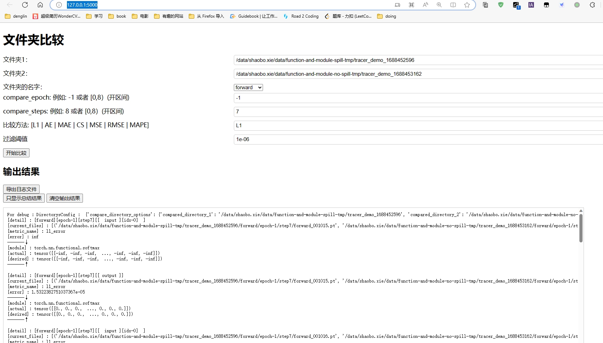
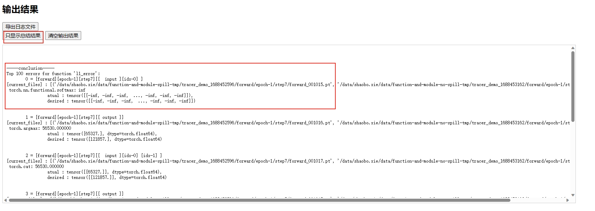
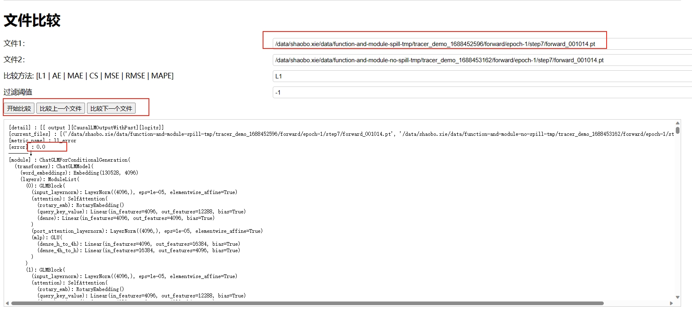
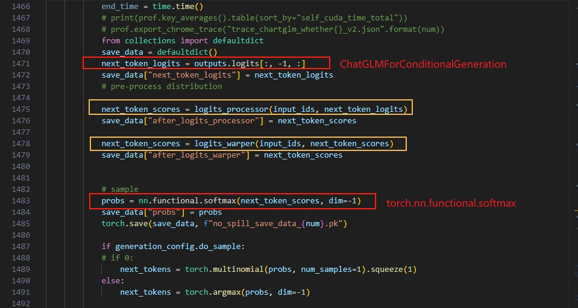

# Hooktools

# 安装
```bash
python setup.py bdist_wheel && pip install dist/hooktools-0.1-py3-none-any.whl --force-reinstall
```

# 定位流程：
1. trace 数据
    + 修改tracer_demo.yaml配置
        + 请查看 hooktools/config/tracer_demo.yaml
        + 如果想一次性定位出问题: 可以同时 trace nn.module的数据和 function的数据
            + 不足： 如果问题出现在 非nn.module的数据和 非function的数据 的 第三方库 的 函数， 那么得翻阅代码，找出module和function之间的哪些第三方库函数。将其 to_cpu 验证一下，是不是这部分代码出现的问题。
        + 如果确定是nn.module 或者是 function 的问题，可以只 trace这部分的数据。
    + 在模型中增加trace相关的代码。
        + 示例1：chatglm-6b, （伪代码，只显示部分。）
            ```python
            ....
            from hooktools import Tracer
            model = AutoModel.from_pretrained("./THUDM/chatglm-6b", trust_remote_code=True).cuda()
            # 这里的tracer_demo.yaml是从hooktools/config/tracer_demo.yaml 拷贝过来的，修改成需要的配置。
            trace = Tracer("./tracer_demo.yaml", model)
            trace.trace()
            generate_step = 0
            for outputs in model.stream_generate(tokenizer,**inputs, **gen_kwargs):
                trace.update_step(generate_step)
                ....
                generate_step +=1
            trace.untrace()
            ....
            ```
        + 示例2：yolov3 , （伪代码，只显示部分。）
            ```python
            from hooktools import Tracer
            model = Yolov3() # 伪代码
            # 这里的tracer_demo.yaml是从hooktools/config/tracer_demo.yaml 拷贝过来的，修改成需要的配置。
            trace = Tracer("./tracer_demo.yaml", model)
            for epoch in range(start_epoch, epochs):
                ....
                for i, (imgs, targets, paths, _) in pbar:
                    ....
                    trace.trace(epoch=epoch, step=i)
                    ....
                    trace.untrace()
                ....
            ....

            ```
2. compare 数据
    + experimental/compare_url.py
    
    + 输入需要对比的文件夹，和其他配置选项
    + 开始比较
    + 只显示总结结果
    + 开始分析误差比较大的层

3. to_cpu定位具体问题
    + 例如 pytorch 编译时有 spill 和 no-spill 的配置，在2023年6月，跑chatglm-6b 推理 no-spill有一个错误。
    + 下面是分析步骤：
        + 通过上面的 trace 和 compare 步骤。 可以看出：
        + 在 step7 的时候，torch.nn.functional.softmax 这个函数的输入 误差相差极大。
            
        + 由于这个Input，输入的时候误差很大，所以我们怀疑，上一层的输出是否有问题。
        + 我们点一下比较上一个文件，就可以看到上一层，是一个module: ChatGLMForConditionalGeneration
            
        + 分析发现，上一层的输入，输出，是完全相同的，误差为0
        + 所以问题，就出现在了 这两者之间的，没有被trace 到的第三方库的函数上。因此简单翻阅代码就可以找出来了。
            + 翻阅源码， 通过 torch.nn.functional.softmax 和 ChatGLMForConditionalGeneration 可以很容易找出所在源码位置：
                
            + 简单的，将他们两个，to_cpu, 发现 no_spill 的 错误，解决了。
                + （进一步定位，发现其实是两个中的logits_warper函数有问题）
                + to_cpu 示例代码：
                    ```python
                        next_token_scores = logits_warper(input_ids, next_token_scores)
                        # to_cpu() ↓
                        next_token_scores = logits_warper(input_ids.cpu(), next_token_scores.cpu()).cuda()
                    ```
    + 其他说明：
        + 如果是 nn.module 或者 function 有问题，直接 to_cpu验证就行。
        + 如果是 nn.module 和 function 之间的 某些第三方库 的问题，翻阅源码， to_cpu验证就行。
